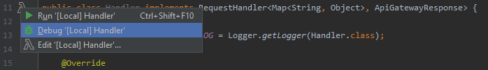

# Serverless hello world java example
Created with the serverless framework java template.
clone the repository and open with IntelliJ. If you have the AWS toolkit, AWS CLI and AWS SAM CLI installed, you can start the application locally in a docker container
. Open the Handler.java file and locate the Lambda icon in the gutter (left-hand side). Click on it to invoke the aws sam client.

## Setup
Comprehensive [AWS toolkit](https://docs.aws.amazon.com/toolkit-for-jetbrains/latest/userguide/key-tasks.html#key-tasks-install)
install [docker](https://docs.docker.com/get-docker/)
install [AWS CLI](https://docs.aws.amazon.com/cli/latest/userguide/cli-chap-install.html)
install [AWS SAM CLI](https://docs.aws.amazon.com/serverless-application-model/latest/developerguide/serverless-sam-cli-install-windows.html)
setup [AWS credentials](https://docs.aws.amazon.com/toolkit-for-jetbrains/latest/userguide/setup-credentials.html)

